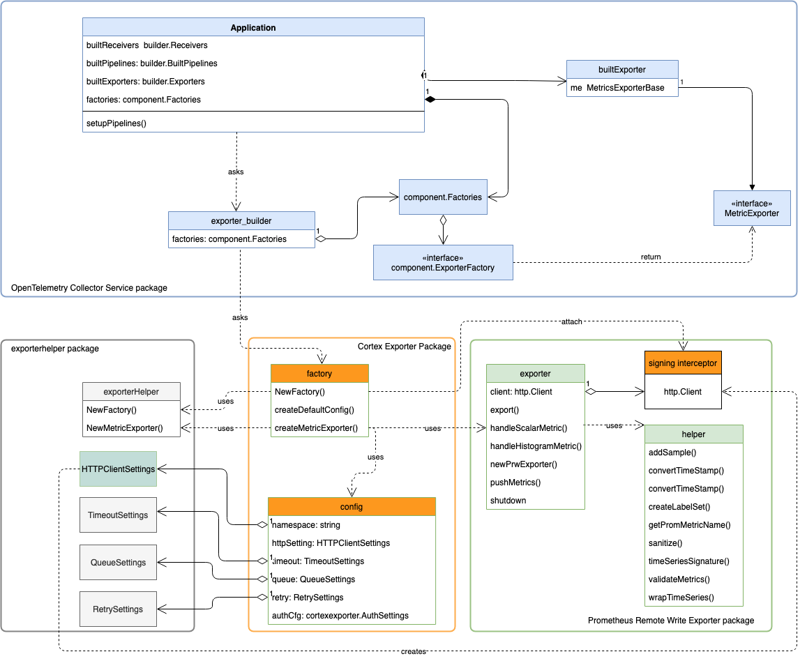

# Design 
The Cortex exporter imports and uses the [Prometheus remote write exporter](https://github.com/open-telemetry/opentelemetry-collector/tree/master/exporter/prometheusremotewriteexporter)
from upstream; The functions that it needs from the upstream package are:

- `prometheusremotewriteexporter.NexExporter`
- `prometheusremotewriteexporter.PushMetrics`
- `prometheusremotewriteexporter.Shutdown`

The Cortex exporter uses its factory to wrap the Prometheus remote write exporter(referred to as the upstream exporter) 
implementation of the exporter, and passes a HTTP client interceptor that signs each outgoing request to the underlying 
exporter. The following section describes how this is accomplished. 

## Initialization of the Cortex Exporter in the Collector 

The Collector keeps track of a set of [registered factories](../../cmd/otelcol/components.go) for each supported 
component. These factories are used to initialize individual component. Each component also has a custom configuration 
defined in a config.go file; this configuration specifies the parameters that its factory should initialize the 
component with. 

The Cortex exporter follows this pattern and has a configuration and a exporter. Its [configuration](./config.go) 
is the same as the upstream exporter, with the addition of a `AuthSettings` field specifying information for AWS Sig V4. 
Its [factory](factory.go) is different from the upstream exporter's factory; 
the factory can process the `AuthSettings` field in configuration and create a `http.RoundTripper` that can sign each request. 

During application initialization, the Collector asks exporter 
builders, a service package component, for an implementation of the MetricExporter interface. Then, the exporter builder
invokes the registered factory inside the Cortex Exporter package to create an instance of the Cortex Exporter. 
When invoked, the factory initializes an implementation of the upstream exporter; the upstream exporter takes an 
`http.Client` in its constructor, so the factory adds the signing RoundTripper inside the `http.Client` used by the
upstream exporter. The following is a code snippet of this process. The complete code is implemented here [here](factory.go)

```
cfg configmodels.Exporter) (component.MetricsExporter, error) {
	// check if the configuration is valid
	prwCfg, ok := cfg.(*Config)

	// load AWS auth configurations and create interceptor based on configuration
	if prwCfg.AuthSettings.Enabled {
		roundTripper, err := NewAuth(prwCfg.AuthSettings, client)
		if err != nil {
			return nil, err
		}
		client.Transport = roundTripper
	}

	// initialize an upstream exporter and pass it an http.Client with interceptor
	prwe, err := prw.NewPrwExporter(prwCfg.Namespace, prwCfg.HTTPClientSettings.Endpoint, client)
	if err != nil {
		return nil, err
	}

	return prwexp, err
```

The factory then returns the Cortex exporter implementation back to the Collector application, which runs the data 
pipeline with the Cortex exporter. During an export operation, the Cortex exporter behaves the same as the upstream 
exporter, except it signs each outgoing request. 

The following diagram demonstrates the initialization process.



## References 
- Upstream Exporter [DESIGN](https://github.com/open-telemetry/opentelemetry-collector/blob/master/exporter/prometheusremotewriteexporter/DESIGN.md) 
and [README](https://github.com/open-telemetry/opentelemetry-collector/tree/master/exporter/prometheusremotewriteexporter)

- exporterhelper package [detail](https://github.com/open-telemetry/opentelemetry-collector/blob/master/exporter/exporterhelper/metricshelper.go)